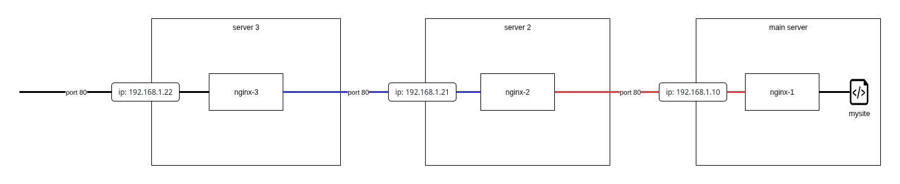

## Simpliest Proxy config

assume, your server with web-site has IP 192.168.1.10 
and your proxy-servers have IPs 192.168.1.21 and 192.168.1.22 

nginx-1.conf - config for `main` server with web-site 
now you can show it in browser: `http://192.168.1.10`  

nginx-2.conf - config for `server2` which is proxy 
now you can show web-site via this proxy in browser: `http://192.168.1.21`  

nginx-3.conf - config for `server3` which is proxy for another proxy 
now you can show web-site via this proxy in browser: `http://192.168.1.22`  

and now you have the current chain of reqests: 
[your PC] -> [`server3` (192.168.1.22)] -> [`server2` (192.168.1.21)] -> [`main` server (192.168.1.10)]  

if you turn off `server2` and make request to `server3` again, you receive `ERR_ADDRESS_UNREACHABLE` "This site can’t be reached"

  

