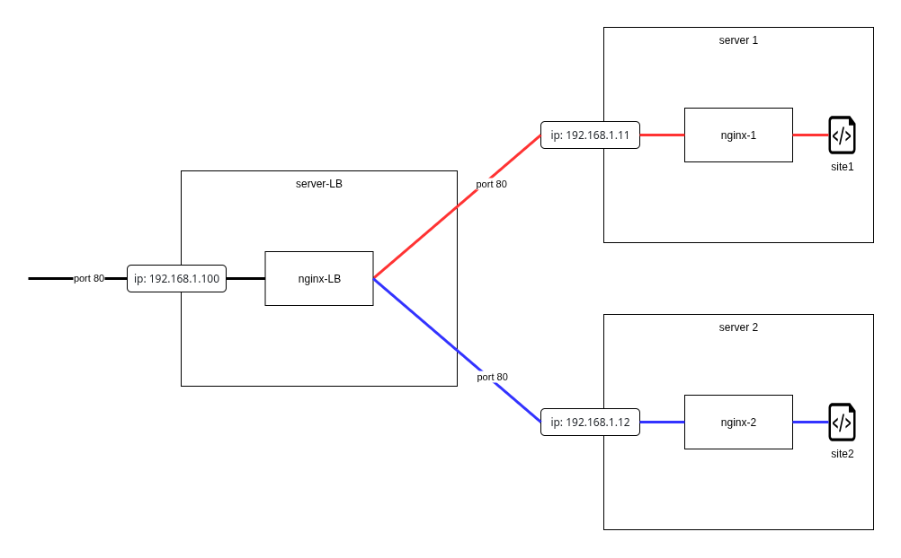

## Load Balancer config

assume, your load balancer IP is 192.168.1.100<br>
and your servers IP are 192.168.1.11 and 192.168.1.12<br>
* it's better to have two different pages for experiment<br>

<br>
repeat on the 1 and 2 computers (via ssh)

```
move your site to the /var/www/ dir
# cp -r ~/mysite-1-or-2 /var/www/

set nginx1-2.conf as /etc/nginx/nginx.conf

sudo systemctl reload nginx
sudo systemctl restart nginx

open http://192.168.1.11 and http://192.168.1.12 in browser to ensure that both sites can be displayed
```

on the load balancing computer do the following
```
set nginx-lb.conf as /etc/nginx/nginx.conf

sudo systemctl reload nginx
sudo systemctl restart nginx

open http://192.168.1.100 in browser and reload several times - it must display different pages (1 and 2) in the random order
```

 <br>

